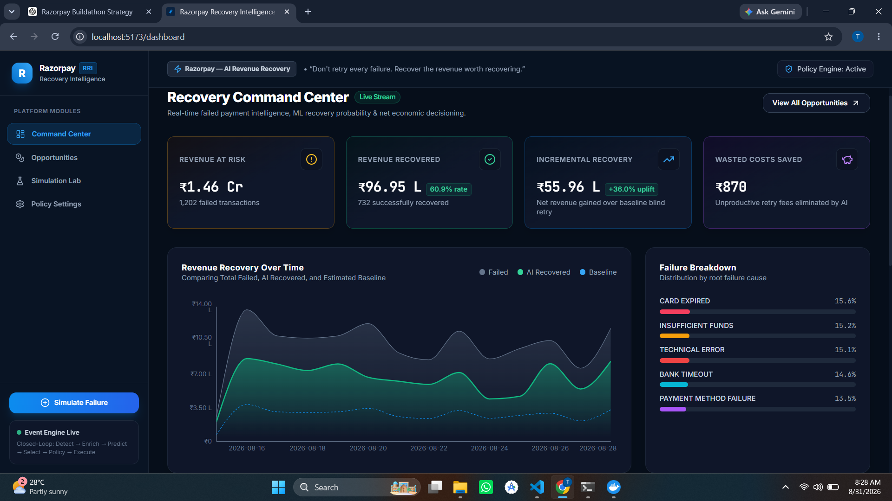
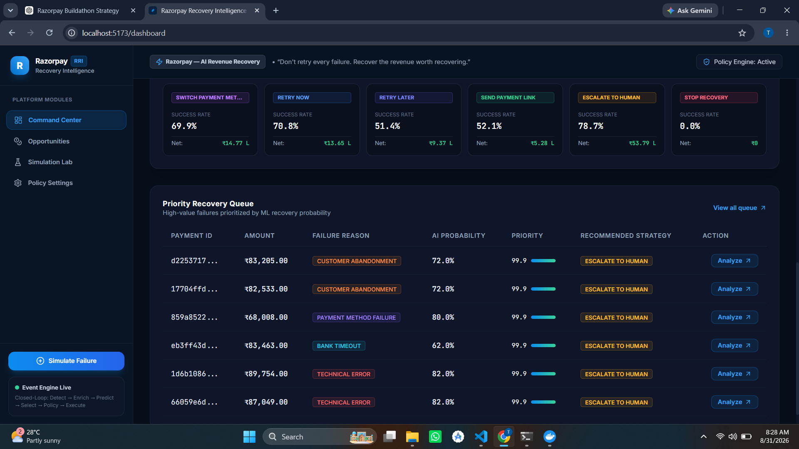
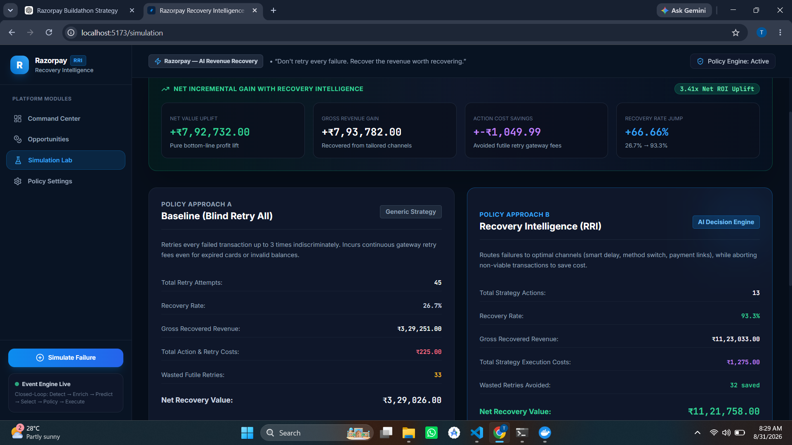

# Razorpay Recovery Intelligence (RRI)

> ### **Don't retry every failure. Recover the revenue worth recovering.**

**Razorpay Recovery Intelligence (RRI)** is an AI-powered payment recovery decision system that helps identify failed payment opportunities, estimate their probability of recovery, and recommend the most economically valuable recovery strategy.

Instead of blindly retrying every failed transaction, RRI answers:

* **Which failed payments are worth recovering?**
* **What recovery strategy should be used?**
* **When should the recovery action happen?**
* **Is the recovery economically worthwhile?**

---

## 🎯 The Problem

Payment failures are inevitable.

They can happen because of:

* Insufficient funds
* Card expiry
* Bank timeouts
* Technical errors
* Payment method failures
* Customer abandonment

The problem is that **not every failed payment should be treated the same way**.

A traditional recovery approach may retry transactions using generic rules:

```text
Payment Failed
      ↓
Retry
      ↓
Retry Again
      ↓
Retry Again
```

This creates several problems:

* ❌ Unnecessary retry costs
* ❌ Wasted recovery attempts
* ❌ Poor prioritization of high-value payments
* ❌ The same strategy is applied to different failure types
* ❌ No intelligence about whether recovery is economically worthwhile

A ₹500 transaction with a very low recovery probability should not receive the same treatment as a ₹80,000 transaction that failed because of a temporary bank timeout.

---

# 💡 The Solution

## Razorpay Recovery Intelligence

RRI introduces an **intelligence and decision layer** for failed payment recovery.

```text
                 PAYMENT FAILURE
                        │
                        ▼
              Event & Data Enrichment
                        │
                        ▼
          AI Recovery Probability Prediction
                        │
                        ▼
          Economic Decision & Priority Engine
                        │
                        ▼
             Policy & Safety Validation
                        │
                        ▼
         Recommended Recovery Strategy
                        │
                        ▼
              Recovery Outcome Tracking
```

The system combines:

### 🧠 AI Prediction

Estimates the probability that a failed transaction can be recovered.

### 💰 Economic Decisioning

Evaluates whether attempting recovery creates positive expected value.

### 🛡️ Policy Engine

Ensures recovery actions follow configured business rules.

### 🎯 Strategy Selection

Selects the most appropriate action instead of blindly retrying.

---

# 📸 Product Preview

## 🖥️ Recovery Command Center

The Recovery Command Center provides a real-time view of failed payment intelligence, revenue recovery, incremental value, and failure patterns.



### Key capabilities

* Revenue at risk tracking
* Revenue recovered tracking
* Incremental recovery measurement
* Wasted retry cost savings
* Recovery trends over time
* Failure reason distribution

---

## 🎯 Priority Recovery Queue

Instead of treating every failed payment equally, RRI prioritizes recovery opportunities.



Each opportunity includes:

* Payment ID
* Transaction amount
* Failure reason
* AI recovery probability
* Priority score
* Recommended recovery strategy

This allows the system to focus attention on **high-value and high-probability recovery opportunities**.

---

## 🧪 Simulation Lab — Baseline vs Recovery Intelligence

The Simulation Lab demonstrates the difference between traditional retry logic and intelligent recovery decisioning.



### Traditional Approach

```text
Baseline Strategy
────────────────────────

Failed Payment
       ↓
Retry Everything
       ↓
More Retry Attempts
       ↓
Higher Costs
```

### Recovery Intelligence

```text
RRI Strategy
────────────────────────

Failed Payment
       ↓
AI Probability Prediction
       ↓
Economic Evaluation
       ↓
Best Strategy Selection
       ↓
Policy Validation
       ↓
Execute / Delay / Switch / Stop
```

The simulation compares both approaches across metrics such as:

* Recovery rate
* Gross recovered revenue
* Recovery execution costs
* Wasted retry attempts
* Net recovery value
* Incremental value generated

> **Important:** Simulation results shown in the application are generated using a controlled synthetic dataset and simulation environment. They demonstrate the potential value of intelligent recovery decisioning and are not claims about Razorpay production data.

---

# 🚀 How It Works

## Step 1 — Payment Failure Occurs

A payment failure enters the recovery intelligence workflow.

Example:

```json
{
  "payment_id": "pay_xxxxx",
  "amount": 83205,
  "failure_reason": "BANK_TIMEOUT"
}
```

---

## Step 2 — Enrich the Failure Context

The system evaluates relevant transaction information.

Examples include:

* Transaction amount
* Failure reason
* Payment method
* Historical recovery patterns
* Retry history
* Transaction context

---

## Step 3 — AI Predicts Recovery Probability

The ML model estimates:

```text
Probability of Recovery: 72%
```

This helps distinguish between:

```text
Low-value opportunity
Low recovery probability
        ↓
Avoid unnecessary recovery cost
```

and:

```text
High-value opportunity
High recovery probability
        ↓
Prioritize recovery
```

---

## Step 4 — Priority Engine Evaluates Value

RRI does not prioritize transactions based only on recovery probability.

It considers the economic opportunity.

Conceptually:

```text
Priority =
Transaction Value
×
Recovery Probability
×
Expected Economic Value
```

This prevents the system from wasting resources on recovery attempts that are unlikely to create meaningful value.

---

## Step 5 — Select the Best Recovery Strategy

Depending on the failure context, RRI can recommend strategies such as:

| Strategy                 | When It May Be Used                                |
| ------------------------ | -------------------------------------------------- |
| 🔄 Retry Now             | Temporary or potentially recoverable failures      |
| ⏳ Retry Later            | Failures that may resolve after time               |
| 💳 Switch Payment Method | Payment method-specific failures                   |
| 🔗 Send Payment Link     | Customer-driven recovery                           |
| 👤 Escalate to Human     | High-value or exceptional cases                    |
| 🛑 Stop Recovery         | Low-value or economically non-viable opportunities |

The key difference is:

> **The system does not assume that retrying is always the correct answer.**

---

## Step 6 — Policy Engine Validates the Action

Before execution, the recommended action passes through the Policy Engine.

The policy layer can enforce rules such as:

* Maximum retry limits
* Strategy restrictions
* Transaction value thresholds
* Human escalation requirements
* Recovery safety constraints

```text
AI Recommendation
        ↓
Policy Validation
        ↓
Approved Action
```

---

# 🧠 Recovery Intelligence Architecture

```text
┌─────────────────────────────────────────────┐
│              React Frontend                 │
│                                             │
│  Command Center │ Opportunities │ Simulation│
└──────────────────────┬──────────────────────┘
                       │
                       ▼
┌─────────────────────────────────────────────┐
│                Go Backend                   │
│                                             │
│ API │ Decision Engine │ Policy Engine       │
└───────────────┬─────────────────────────────┘
                │
        ┌───────┴────────┐
        ▼                ▼
┌───────────────┐  ┌────────────────┐
│ PostgreSQL    │  │ ML Service     │
│               │  │ Python/FastAPI │
└───────────────┘  └────────────────┘
                         │
                         ▼
                    ML Model
```

---

# 🛠️ Technology Stack

The project uses a microservice-oriented architecture.

### Frontend

* React
* TypeScript

### Backend

* Go

### Intelligence Layer

* Python
* FastAPI
* Machine Learning model

### Data Layer

* PostgreSQL

### Infrastructure

* Docker
* Docker Compose

### Event Architecture

* Event-driven workflow design
* Kafka integration where applicable in the application pipeline

---

# ⚡ Quick Start

## Prerequisites

Install:

* Docker
* Docker Compose

## Run the Application

```bash
git clone <YOUR_REPOSITORY_URL>
cd <YOUR_PROJECT_NAME>
docker compose up --build
```

Once the services are running, open:

```text
http://localhost:5173
```

---

# 📂 Project Structure

```text
RecoveryIntelligenceSystem/
├── .env
├── .env.example
├── .gitignore
├── docker-compose.yml
├── README.md
│
├── backend/
│   ├── Dockerfile
│   ├── go.mod
│   ├── go.sum
│   ├── cmd/
│   │   └── api/
│   │       └── main.go
│   ├── internal/
│   │   ├── audit/
│   │   │   └── logger.go
│   │   ├── config/
│   │   │   └── config.go
│   │   ├── domain/
│   │   │   ├── customer.go
│   │   │   ├── events.go
│   │   │   ├── merchant.go
│   │   │   ├── payment.go
│   │   │   └── recovery.go
│   │   ├── handler/
│   │   │   ├── dashboard_handler.go
│   │   │   ├── recovery_handler.go
│   │   │   ├── settings_handler.go
│   │   │   ├── settings_handler_test.go
│   │   │   └── simulation_handler.go
│   │   ├── kafka/
│   │   │   └── event_bus.go
│   │   ├── middleware/
│   │   │   ├── cors.go
│   │   │   ├── idempotency.go
│   │   │   └── ratelimit.go
│   │   ├── policy/
│   │   │   └── engine.go
│   │   ├── redis/
│   │   │   └── client.go
│   │   ├── repository/
│   │   │   ├── audit_repo.go
│   │   │   ├── customer_repo.go
│   │   │   ├── db.go
│   │   │   ├── merchant_repo.go
│   │   │   ├── payment_repo.go
│   │   │   ├── recovery_repo.go
│   │   │   └── seeder.go
│   │   └── service/
│   │       ├── ml_client.go
│   │       ├── recovery_service.go
│   │       ├── recovery_service_test.go
│   │       └── simulation_service.go
│   ├── migrations/
│   │   ├── 001_init_schema.down.sql
│   │   └── 001_init_schema.up.sql
│   └── tests/
│       ├── economic_engine_test.go
│       └── policy_test.go
│
├── docs/
│   ├── api-contracts.md
│   ├── architecture.md
│   ├── demo-flow.md
│   ├── kafka-events.md
│   ├── ml-model.md
│   └── images/
│       ├── dashboard.png
│       ├── opportunities.png
│       └── simulation.png
│
├── frontend/
│   ├── Dockerfile
│   ├── index.html
│   ├── nginx.conf
│   ├── package.json
│   ├── package-lock.json
│   ├── postcss.config.js
│   ├── tailwind.config.js
│   ├── tsconfig.json
│   ├── vite.config.ts
│   ├── public/
│   └── src/
│       ├── App.tsx
│       ├── index.css
│       ├── main.tsx
│       ├── vite-env.d.ts
│       ├── api/
│       │   └── client.ts
│       ├── components/
│       │   ├── ExecutionModal.tsx
│       │   ├── IngestEventModal.tsx
│       │   └── KPICard.tsx
│       ├── features/
│       │   ├── dashboard/
│       │   │   └── DashboardPage.tsx
│       │   ├── opportunities/
│       │   │   └── OpportunitiesPage.tsx
│       │   ├── payment-details/
│       │   │   └── PaymentDetailPage.tsx
│       │   ├── settings/
│       │   │   └── SettingsPage.tsx
│       │   └── simulation/
│       │       └── SimulationPage.tsx
│       ├── layouts/
│       │   └── AppLayout.tsx
│       ├── types/
│       │   └── index.ts
│       └── utils/
│           └── formatters.ts
│
├── ml-service/
│   ├── Dockerfile
│   ├── requirements.txt
│   ├── app/
│   │   ├── main.py
│   │   ├── api/
│   │   │   └── endpoints.py
│   │   ├── schemas/
│   │   │   └── prediction.py
│   │   └── services/
│   │       └── predictor.py
│   ├── artifacts/
│   │   ├── lr_model.joblib
│   │   ├── model_metadata.json
│   │   ├── scaler.joblib
│   │   ├── shap_explainer.joblib
│   │   └── xgb_model.joblib
│   ├── data/
│   │   └── synthetic/
│   │       └── payments_recovery_synthetic.csv
│   ├── tests/
│   │   └── test_prediction.py
│   └── training/
│       ├── evaluate.py
│       ├── feature_engineering.py
│       ├── generate_dataset.py
│       └── train.py
│
└── scripts/
  ├── health-check.ps1
  ├── health-check.sh
  ├── run-training.ps1
  ├── run-training.sh
  ├── seed-data.ps1
  └── seed-data.sh

└── simulator/
  ├── event-generator/
  │   └── generator.py
  └── recovery-simulator/
    └── scenario_runner.py
```

---

# 📊 Intelligence Layer

The ML layer is responsible for estimating the likelihood of payment recovery.

The prediction is used as **one input into the decision**, not as the only decision-maker.

```text
                    ML Model
                       │
                       ▼
             Recovery Probability
                       │
                       ▼
       Economic Decision Engine
                       │
                       ▼
            Policy Validation
                       │
                       ▼
         Recommended Strategy
```

This separation is intentional.

### ML answers:

> **How likely is this payment to recover?**

### Economic Engine answers:

> **Is recovery worth attempting?**

### Policy Engine answers:

> **Is this action allowed?**

This creates a more controlled architecture than allowing an ML model to directly execute financial actions.

---

# 📈 Why This Matters

## Traditional Recovery

```text
Failure
  ↓
Generic Retry
  ↓
More Attempts
  ↓
Higher Operational Cost
```

## Recovery Intelligence

```text
Failure
  ↓
Understand Context
  ↓
Predict Recovery Probability
  ↓
Calculate Economic Value
  ↓
Select Best Strategy
  ↓
Validate Policy
  ↓
Recover Revenue Intelligently
```

---

# 🎯 Key Product Differentiation

| Traditional Retry System      | Recovery Intelligence          |
| ----------------------------- | ------------------------------ |
| Retries broadly               | Prioritizes intelligently      |
| Same action for many failures | Context-aware strategy         |
| Optimizes retry attempts      | Optimizes expected value       |
| Limited prioritization        | AI-powered opportunity ranking |
| Retry-focused                 | Multi-strategy recovery        |
| Limited economic reasoning    | Cost-aware decisioning         |
| Reactive                      | Data-driven                    |

---

# 🧪 What Is Real vs Simulated?

Transparency is important.

## ✅ Implemented in the MVP

* Working frontend application
* Recovery Command Center
* Opportunity prioritization
* Recovery probability display
* Strategy recommendations
* Policy Engine workflow
* Baseline vs RRI simulation
* Backend services
* Database persistence
* Dockerized application environment

## ⚠️ Simulated / Prototype Environment

* Historical payment dataset used for experimentation
* Recovery outcomes used in simulation
* Production-scale payment execution
* Direct production Razorpay payment infrastructure integration

The MVP demonstrates the **product architecture and decisioning workflow**, while real-world deployment would require validation using authorized production-grade payment data and integrations.

---

# 💥 What Broke During Development?

Building the system required solving integration and reliability challenges.

## Challenge: End-to-End Service Integration

One of the key challenges was ensuring that independently running services could communicate reliably inside the Docker environment.

The frontend, backend, database, and intelligence services need to behave as one system.

### The problem

Services that worked individually could fail when running together because container environments do not behave like local `localhost` development.

### The solution

The architecture was adjusted to use:

* Docker service networking
* Environment-based configuration
* Service dependency handling
* Health-aware startup configuration

### What we learned

> **A system is not truly working because every service works independently. It is working when the entire workflow works end-to-end.**

---

# 🔮 Future Roadmap

With access to production-grade infrastructure and authorized payment data, the next steps would include:

### 1. Real-Time Event Integration

Integrate directly with payment failure events.

### 2. Production Model Training

Train and validate recovery models using real historical data.

### 3. Experimentation Framework

Run controlled experiments between recovery strategies.

### 4. Dynamic Strategy Optimization

Continuously learn which recovery actions perform best.

### 5. Merchant-Level Configuration

Allow businesses to configure recovery policies based on:

* Risk tolerance
* Transaction size
* Retry costs
* Customer segments

### 6. Explainable Decisions

Provide clear explanations such as:

```text
Recommended: Retry Later

Why?

✓ High transaction value
✓ Temporary bank timeout
✓ Strong historical recovery pattern
✓ Positive expected economic value
```

---

# 💼 Business Impact

RRI has the potential to create value by:

### 💰 Increasing Recoverable Revenue

Prioritizing high-value, high-probability opportunities.

### 📉 Reducing Waste

Avoiding recovery attempts that are unlikely to succeed.

### 🎯 Improving Decision Quality

Selecting strategies based on transaction context rather than generic retry rules.

### 🔄 Increasing Merchant Value

Helping merchants recover more potentially lost revenue.

### 📊 Creating a Decision Intelligence Layer

Extending payment infrastructure with intelligent recovery decisioning.

---

# 🏆 Buildathon Submission Summary

## The Problem

Not every failed payment deserves the same recovery action.

## The Solution

An AI-powered recovery intelligence layer that predicts recoverability, evaluates economic value, validates policy, and recommends the best recovery strategy.

## The Differentiator

> **We don't optimize for more retries. We optimize for smarter recovery decisions.**

---

# 👨‍💻 Built For

## Razorpay Buildathon

**Razorpay Recovery Intelligence (RRI)**

### **Don't retry every failure. Recover the revenue worth recovering.**

---
